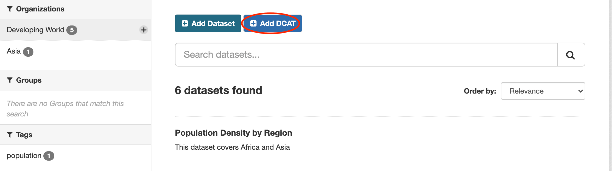
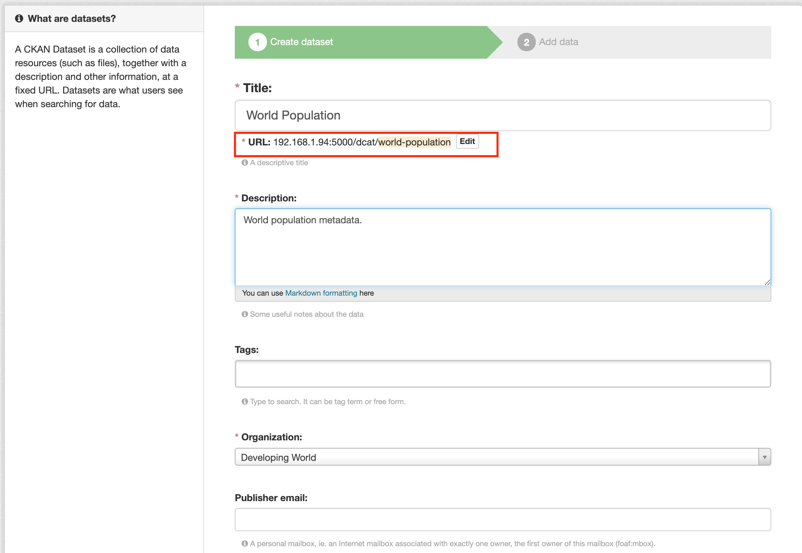
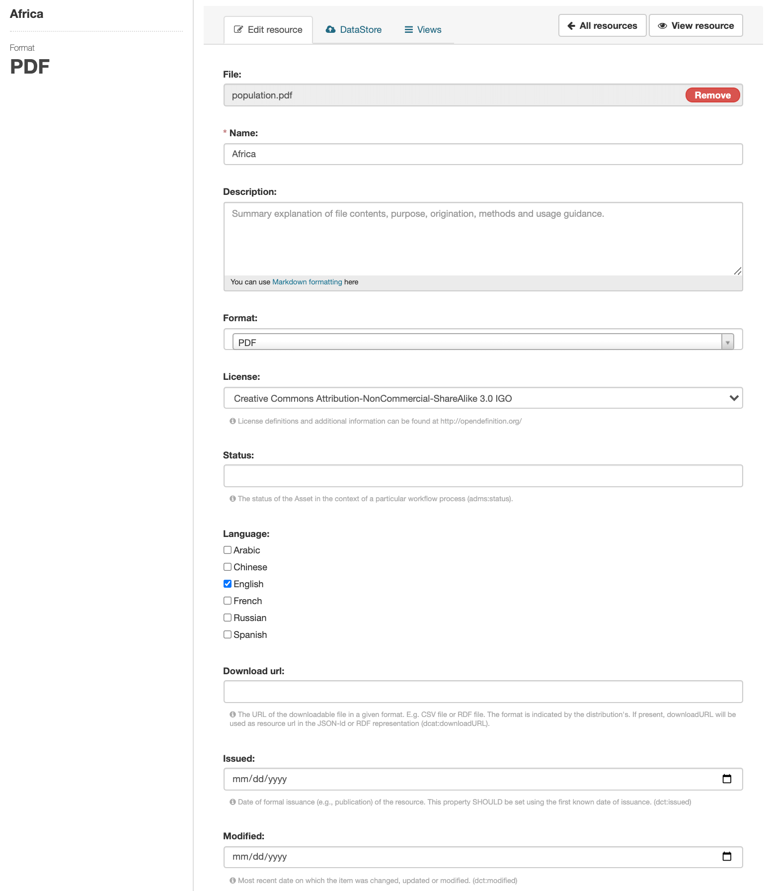
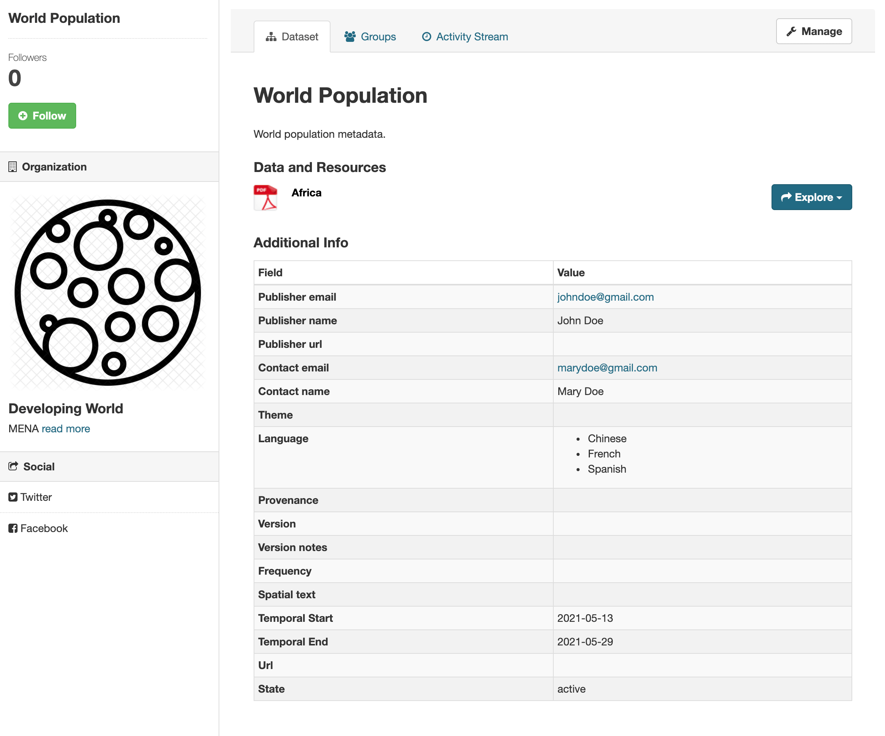

ckanext-scheming_dcat
=====================================

|
|

**ckanext-scheming_dcat** provides the DCAT interface to create DCAT **metadata** and **resources**.

The plugin utilizes the exposed features of DCAT by extending the official DCAT plugin from CKAN https://github.com/ckan/ckanext-dcat.

|
|

**Image below**: A **DCAT add button** will be added to your theme.

|

|

**Image below**: Creating a **DCAT** package.

|

|

**Image below**: Creating a **DCAT** resource.

|

|

**Image below**: Viewing a **DCAT** package and resource.

|

|

Requirements
------------

Before installing ckanext-scheming_dcat, make sure that you have installed the following:

* CKAN 2.8 and above
* DCAT (https://github.com/ckan/ckanext-dcat)
* ckanext-scheming (https://github.com/ckan/ckanext-scheming.git)

|

Installation
------------

To install ckanext-scheming_dcat:

1. Activate your CKAN virtual environment, for example::

     . /usr/lib/ckan/default/bin/activate

2. Install the ckanext-scheming_dcat Python package into your virtual environment::

     pip install ckanext-scheming_dcat

3. Add ``dcat dcat_json_interface structured_data scheming_datasets scheming_organizations scheming_dcat`` to the ``ckan.plugins`` setting in your CKAN
   config file (by default the config file is located at
   ``/etc/ckan/default/production.ini``).

4. Restart CKAN. For example if you've deployed CKAN with Apache on Ubuntu::

     sudo service apache2 reload

|

Configuration
-------------

You must make sure that the following is set in your CKAN config::

    ckan.plugins = dcat dcat_json_interface structured_data scheming_datasets scheming_organizations scheming_dcat

    # OPTIONALLY CONFIGURE DCAT
    ckanext.dcat.rdf.profiles = euro_dcat_ap ckanext.dcat.enable_rdf_endpoints = True

    # Scheming # module-path:file to schemas being used
    scheming.dataset_schemas = ckanext.scheming_dcat:scheming/dcat.yaml
    scheming.organization_schemas = ckanext.scheming_dcat:scheming/dcat_org.json
    scheming.presets = ckanext.scheming_dcat:scheming/presets.json

|

Development
-----------

To install ckanext-scheming_dcat for development, activate your CKAN virtualenv and do::

    git clone https://bitbucket.org/cioapps/ckanext-scheming_dcat.git
    cd ckanext-scheming_dcat
    python setup.py develop
|

Tests
-----

To run the tests:

1. Activate your CKAN virtual environment, for example::

     . /usr/lib/ckan/default/bin/activate

2. From the CKAN root directory (not the extension root) do::

    pytest --ckan-ini=test.ini ckanext/scheming_dcat/tests

|
|

Creating a DCAT package
-----------------------
    
.. list-table:: The table below shows required and type of values to pass to the fields
   :header-rows: 1

   * - Field Name
     - Type
     - Validation
     - Description
     - Required
   * - publisher_url
     - string
     - url
     - (foaf:homepage) A 'homepage' in this sense is a public Web document
     - false
   * - publisher_email
     - string
     - email
     - Internet mailbox associated with exactly one owner
     - false
   * - provenance
     - string
     - url
     - A link from a metadata description to the project that generated the metadata
     - false
   * - owner_org
     - string
     - string
     - The id of the dataset’s owning organization
     - true
   * - notes
     - string
     - string
     - A description of the dataset
     - true
   * - name
     - string
     - string
     - The name of the new dataset, must be between 2 and 100 characters long and contain only lowercase alphanumeric characters, - and _, e.g. 'warandpeace'
     - true
   * - contact_email
     - string
     - email
     - The maintainer or the author's email
     - false
     
**ckanext-scheming_dcat** also provides a field called language which takes a string

.. list-table:: Supported Languages
   :header-rows: 1

   * - Language
     - Value
   * - Arabic
     - ARA
   * - Chinese
     - ZHO
   * - English
     - ENG
   * - French
     - FRA
   * - Russian
     - RUS
   * - Spanish
     - SPA
     

Creating a DCAT Metadata with **python**

.. code-block:: python

    base_url = "http://localhost:5000"
    
    def create_package(API_KEY, organization_name='Africa', package_name,
                   language=['ENG',
                             'SPA']):
    dcat_metadata = {
        "frequency": "previous version released in 1981",
        "title": package_name,
        "name": str(package_name).lower(),
        "description": "The dataset on a number of motor sports activities across the continent",
        "owner_org": organization_name,
        "private": True,
        "theme": "mena",
        "is_version_of": ["https://data.afrostats.org/dcat/1990-africa","https://data.afrostats.org/2000-africa"],
        "version_notes": "Version one from 1974 to 2000",
        "language": language,
        "provenance": "https://www.metadatagenerator.com/provenance",
        "type": "dcat",
        "has_version": ["https://data.afrostats.org/dcat/africa"],
        "source": ["https://data.afrostats.org/dcat/gov"],
        "tags": [
            {
                "name": "population"
            }
        ],
        "temporal_start": "2006-01-01",
        "temporal_end": "2007-09-21",
        "publisher_name": "Ahmed Mascud",
        "publisher_email": "ahmed@gov.co.za",
        "publisher_url": "http://www.publisher.com",
        "contact_name": "Central Afro Stats",
        "contact_email": "info@gov.afri",
        "state": "active",
        "version": "Afro Rev.4",
        "notes": "These are notes",
        "documentation": ["https://data.afrostats.org/ckan/motor-sports/"],
    }

    r = requests.post(base_url + "/api/action/package_create",
                      data=json.dumps(dcat_metadata),
                      headers={"Authorization": API_KEY,
                               'Content-Type': "application/json"})

    if r.status_code != 200:
        print ("Error while creating package: {0}".format(r.content))
    else:
        print ("package was was created " + str(r.content))
    return r

